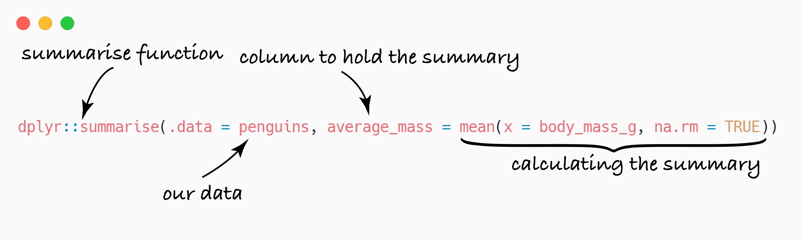

```{r setup, include=FALSE}
library(learnr)
library(tibble)
library(readr)
library(gradethis)
library(dplyr)
library(palmerpenguins)
penguins <- palmerpenguins::penguins
knitr::opts_chunk$set(exercise.warn_invisible = FALSE, echo=FALSE)

```

## Introduction

In the last tutorial we learned how to you the `dplyr` package to **manipulate** data by filtering using `dplyr::filter()`, selecting columns using `dplyr::select()`, and creating new columns with the `dplyr::mutate()` function.

This week's tutorial will be in two parts. In **Part One** we'll learn how to create summarises of dataset using the `dplyr` package. Many of the summarises that we'll be creating will involve multiple steps where we use the output from step as the input for the next step. In **Part Two** we'll learn how we can chain together multiple steps using the pipe operator `%>%`. 

Once again, we'll be working with the `penguins` data.

</img>


## Part One: Creating summarises

The first thing we'll learn about is how to create summaries of data. Summaries that you might want to make include working out the **mean**, the **standard deviation**, or working out the **sample size**. To do this, we'll be using the `dplyr::summarise()` function together with functions that produce statistical summarises: `mean()` (for the mean), `sd()` for the standard deviation, and `n()` for the sample size. 

### The `dplyr::summarise()` function

The `dplyr::summarise()` takes a dataset and collapses all the rows down into a single row of summarises. Because `dplyr::summarise()` creates *summarises*,  it is mainly used in combination with functions that produce statistical summarises—that is, functions like `mean()` and `sd()`. 

Let us take a look at a first example of `dplyr::summarise()` at work. We'll again be using the penguins dataset that we used in the previous tutorial. Run the code below to take a look at the data again. 

```{r show_data, exercise=TRUE, exercise.cap="The data"}
penguins
```

The data contains a column called `body_mass_g` which is the body mass of each penguins. Let's say that we'd like to work out the average mass of the penguins. How would we do this?

We could use the `mean()` function, because the `mean()` function works out averages. And we'd want to use the values inside the `body_mass_g` column as the input to this function. If the values inside the `body_mass_g` column where in their own object called `body_mass_g` then we might write something like this (note: we use `na.rm = TRUE` because that column contains some missing values):

```r
mean(x = body_mass_g, na.rm = TRUE)
```

Now let's try use that with the `dplyr::summarise()` function. Below is an example of what that would look like. It might look long and complicated, so we'll break it down into parts.



- We'll start with the `dplyr::summarise()` part: This is just telling `R` that we'd like to produce a summary!

- Next, inside the `()` we have `.data = penguins`: This means that we'll like to produce a summary of the data inside the object called `penguins`

- Next, we have the part that says `average_mass = mean(x = body_mass_g, na.rm = TRUE)`

  - The first part, `average_mass`, means that we want our summary to be in a column called `average_mass`
  
  - The second part, `mean(x = body_mass_g, na.rm = TRUE)` is the command to actually work out the summary
  
```{r example1, exercise=TRUE, exercise.cap="summarise Example"}
dplyr::summarise(.data = penguins, average_mass = mean(x = body_mass_g, na.rm = TRUE))
```

As you can see from the example, the output is a new dataset with a single row and a single column called `average_mass`.

You'll notice that the syntax is very similar to the syntax used with `dplyr::mutate()` although the output is very different. Just to contrast, let us look at what would happen if we replaced `dplyr::summarise()` with `dplyr::mutate()`. Run the example to check it out.

```{r example2, exercise=TRUE, exercise.cap="Mutate Example"}
dplyr::mutate(.data = penguins, average_mass = mean(x = body_mass_g, na.rm = TRUE))
```

As you can see, `dplyr::mutate()` also produces a new column called `average_mass` that is also the average of the values in the `body_mass_g` column. But instead of collapsing the dataset down into a single row of summaries it just appends that column to the dataset. The output from `dplyr::summarise()` will only contains  columns that were created as part of the call to the summarise function. In contrast `dplyr::mutate()` will add new columns without getting rid of the ones that already exist.

### Grouping a dataset

The `dplyr::summarise()` function isn't super useful by itself, but where it really shines is when it's paired with the `dplyr::group_by()` function. 

The `dplyr::group_by()` groups rows in a dataset according to the values in a specified column or columns. When you use the `dplyr::group_by` function by itself it might difficult to tell whether anything has happened. In the two examples below, you can see the output that would be produced if you just typed the name of the dataset into the `R` **Console**. 

```r
> penguins
# A tibble: 344 x 8
   species island    bill_length_mm bill_depth_mm flipper_length_mm body_mass_g sex     year
   <fct>   <fct>              <dbl>         <dbl>             <int>       <int> <fct>  <int>
 1 Adelie  Torgersen           39.1          18.7               181        3750 male    2007
 2 Adelie  Torgersen           39.5          17.4               186        3800 female  2007
 3 Adelie  Torgersen           40.3          18                 195        3250 female  2007
 4 Adelie  Torgersen           NA            NA                  NA          NA NA      2007
 5 Adelie  Torgersen           36.7          19.3               193        3450 female  2007
 6 Adelie  Torgersen           39.3          20.6               190        3650 male    2007
 7 Adelie  Torgersen           38.9          17.8               181        3625 female  2007
 8 Adelie  Torgersen           39.2          19.6               195        4675 male    2007
 9 Adelie  Torgersen           34.1          18.1               193        3475 NA      2007
10 Adelie  Torgersen           42            20.2               190        4250 NA      2007
# … with 334 more rows
```

And this is what would be produced if you used the `dplyr::group_by` function. We'll break down the command shortly, but let's just look at the output first.

<pre class="r"><code class="hljs">&gt; dplyr::group_by(.data = penguins, species)
<span class="hljs-comment"># A tibble: 344 x 8</span>
<span class="hljs-comment" style="background-color:yellow"># Groups:   species [3]</span>
  species island    bill_length_mm bill_depth_mm flipper_length_mm body_mass_g sex     year
   &lt;fct&gt;   &lt;fct&gt;              &lt;dbl&gt;         &lt;dbl&gt;             &lt;int&gt;       &lt;int&gt; &lt;fct&gt;  &lt;int&gt;
 <span class="hljs-number">1</span> Adelie  Torgersen           <span class="hljs-number">39.1</span>          <span class="hljs-number">18.7</span>               <span class="hljs-number">181</span>        <span class="hljs-number">3750</span> male    <span class="hljs-number">2007</span>
 <span class="hljs-number">2</span> Adelie  Torgersen           <span class="hljs-number">39.5</span>          <span class="hljs-number">17.4</span>               <span class="hljs-number">186</span>        <span class="hljs-number">3800</span> female  <span class="hljs-number">2007</span>
 <span class="hljs-number">3</span> Adelie  Torgersen           <span class="hljs-number">40.3</span>          <span class="hljs-number">18</span>                 <span class="hljs-number">195</span>        <span class="hljs-number">3250</span> female  <span class="hljs-number">2007</span>
 <span class="hljs-number">4</span> Adelie  Torgersen           <span class="hljs-literal">NA</span>            <span class="hljs-literal">NA</span>                  <span class="hljs-literal">NA</span>          <span class="hljs-literal">NA</span> <span class="hljs-literal">NA</span>      <span class="hljs-number">2007</span>
 <span class="hljs-number">5</span> Adelie  Torgersen           <span class="hljs-number">36.7</span>          <span class="hljs-number">19.3</span>               <span class="hljs-number">193</span>        <span class="hljs-number">3450</span> female  <span class="hljs-number">2007</span>
 <span class="hljs-number">6</span> Adelie  Torgersen           <span class="hljs-number">39.3</span>          <span class="hljs-number">20.6</span>               <span class="hljs-number">190</span>        <span class="hljs-number">3650</span> male    <span class="hljs-number">2007</span>
 <span class="hljs-number">7</span> Adelie  Torgersen           <span class="hljs-number">38.9</span>          <span class="hljs-number">17.8</span>               <span class="hljs-number">181</span>        <span class="hljs-number">3625</span> female  <span class="hljs-number">2007</span>
 <span class="hljs-number">8</span> Adelie  Torgersen           <span class="hljs-number">39.2</span>          <span class="hljs-number">19.6</span>               <span class="hljs-number">195</span>        <span class="hljs-number">4675</span> male    <span class="hljs-number">2007</span>
 <span class="hljs-number">9</span> Adelie  Torgersen           <span class="hljs-number">34.1</span>          <span class="hljs-number">18.1</span>               <span class="hljs-number">193</span>        <span class="hljs-number">3475</span> <span class="hljs-literal">NA</span>      <span class="hljs-number">2007</span>
<span class="hljs-number">10</span> Adelie  Torgersen           <span class="hljs-number">42</span>            <span class="hljs-number">20.2</span>               <span class="hljs-number">190</span>        <span class="hljs-number">4250</span> <span class="hljs-literal">NA</span>      <span class="hljs-number">2007</span>
<span class="hljs-comment"># … with 334 more rows</span></code></pre>


They look very similar! But if you look closely you'll see that there's an extra line in the output (highlighted in yellow). This tells you that the dataset is now **grouped**, that it's grouped by the values in the `species` column, and that there are 3 of these groups. 

Let's look at the command that we used to produce that output again. The `dplyr::group_by()` also takes an input called `.data` which is the name of the data set we want to do the grouping on. The next input is the just name of the column (or columns) we want to use as our grouping variable. Writing `species` means we want to group our data set according to the values in the `species` column. 

### Working with a grouped dataset

When we have a **grouped** dataset it behaves a little differently to a dataset that isn't **grouped**. When we use a function like `dplyr::summarise()` or `dplyr::mutate()` on **grouped** data then the function is applied to **each group separately**. Let's see how this works. The example below has 2 steps. In step 1 (on line 1) the `penguins` dataset is grouped by `species`. The output is saved to a new object called `penguins_grouped`. In step 2 (on line 3) the `dplyr::summarise()` function is used with the `penguins_grouped` dataset as the input. Run the example to see the output!

```{r group_sum_example, exercise=TRUE, exercise.cap="Example 1"}
penguins_grouped <- dplyr::group_by(.data = penguins, species)

dplyr::summarise(.data = penguins_grouped, average_mass = mean(x = body_mass_g, na.rm = TRUE))
```

You'll notice line 2 is very similar to the first example when we used `dplyr::summarise()` on the `penguins` dataset. Run the example just to refresh yourself on what the output looks like!

```{r ungroup_sum_example, exercise=TRUE, exercise.cap="Example 1"}
dplyr::summarise(.data = penguins, average_mass = mean(x = body_mass_g, na.rm = TRUE))
```

Notice the difference in the output between Example 1 and Example 2. In Example 2 there's only one summary row, but in Example 1 there's 3 summary rows. There's a summary row for **each group**. You'll also notice that in Example 2 there's only one column—the column that was created by the call to `dplyr::summarise()`. In Example 1, however, there's two columns—the column that was created by the call to `dplyr::summarise()` and the column that holds the grouping variable. In all the exercises we'll always use `dplyr::summarise()` with `dplyr::group_by()`

### Types of summaries

For far, we've only been working out means, but there are other summaries we could be working out. In this section, we'll go through a few of them. 

#### Standard deviations

To work out a standard deviation, we just replace `mean()` with `sd()`. In the example before, we'll still work out the mean, but we'll add in a new column that contains the standard deviation. Notice that we can start a new line after a commas. This doesn't impact how the function runs, but it makes it a little easier for us to read. As before, we'll first group the data, and then run the `dplyr::summarise()` function on the grouped data. Run the example to see the output.

```{r sdexample, exercise=TRUE, exercise.cap="Example 3"}
penguins_grouped <- dplyr::group_by(.data = penguins, species)

dplyr::summarise(.data = penguins_grouped, 
    average_mass = mean(x = body_mass_g, na.rm = TRUE),
    sd_mass = sd(x = body_mass_g, na.rm = TRUE))
```

#### Interquartile range

To work out the interquartile range, we'd just use the `IQR()` function. In the example below, a new column had been added to hold the IQR. 


```{r iqrexample, exercise=TRUE, exercise.cap="Example 4"}
penguins_grouped <- dplyr::group_by(.data = penguins, species)

dplyr::summarise(.data = penguins_grouped, 
    average_mass = mean(x = body_mass_g, na.rm = TRUE),
    sd_mass = sd(x = body_mass_g, na.rm = TRUE),
    IQR_mass = IQR(x = body_mass_g, na.rm = TRUE))
```

#### Counting cases

After from summaries, we might also want to count the number of rows in each group. If we group our data by `species` then counting the number of rows in each group will tell you how many penguins of each species our data contains. To count the number of rows we'll use a function called `n()`. The `n()` function is a little bit special, because it doesn't take any inputs. In the example below we'll count the number of penguins in each species group and put that information in a column called `penguins_per_species`. Run the example to see the output. 


```{r nexample, exercise=TRUE, exercise.cap="Example 5"}
penguins_grouped <- dplyr::group_by(.data = penguins, species)

dplyr::summarise(.data = penguins_grouped, 
    penguins_per_species = n())
```

#### Summarising and calculating

We can get even more fancy if we'd like by mixing summary functions with calculations.  Why might this be useful? One obvious example is if we'd like to calculate a **standard error**. To calculate a **standard error** you need two bits of information. You'll need the **standard deviation** and the **sample size**. You can get these with the `sd()` and `n()` functions, respectively. The **standard errors** is then calculated as $\frac{sd}{\sqrt{n}}$. The example below we'll calculate the **standard error** for each species of penguins. Again, we'll first group the data by `species` and then perform the summary on the grouped data. The only new code in this example is the last line. In this line we'll use the columns that hold the summary values in a calculation. 

```{r seexample, exercise=TRUE, exercise.cap="Example 6"}
penguins_grouped <- dplyr::group_by(.data = penguins, species)

dplyr::summarise(.data = penguins_grouped, 
    sd_mass = sd(body_mass_g, na.rm = TRUE), 
    penguins_per_species = n(), 
    se_mass = sd_mass / sqrt(penguins_per_species))
```

### Code Exercises

Now it's your turn to try it out. 

Work out the average mass for the penguins on each of the islands:
```{r code1,  exercise=TRUE, exercise.cap='Code'}

```

```{r code1-hint-1}
grouped <- dplyr::group_by(.data = penguins, ___)
```


```{r code1-hint-2}
grouped <- dplyr::group_by(.data = penguins, island)
```


```{r code1-hint-3}
grouped <- dplyr::group_by(.data = penguins, island)
dplyr::summarise(.data = grouped, ___)
```

```{r code1-solution}
grouped <- dplyr::group_by(.data = penguins, island)
dplyr::summarise(.data = grouped, mean_mass = mean(body_mass_g, na.rm = TRUE))
```

Now work out the average flipper length of each sex of each species! (Hint: you'll been to group by two columns!)

```{r code2,  exercise=TRUE, exercise.cap='Code'}

```

```{r code2-hint-1}
grouped <- dplyr::group_by(.data = penguins, ___)
```


```{r code2-hint-2}
grouped <- dplyr::group_by(.data = penguins, sex, species)
```

```{r code2-hint-3}
grouped <- dplyr::group_by(.data = penguins, sex, species)
dplyr::summarise(.data = grouped, ___)
```

```{r code2-solution}
grouped <- dplyr::group_by(.data = penguins, sex, species)
dplyr::summarise(.data = grouped, mean_flipper_length = mean(flipper_length_mm, na.rm = TRUE))
```


## Part Two: Pipes `%>%`


In **summarising data** section we were using the `dplyr::summarise()` function together with the `dplyr::group_by()` function in a two step operation.

In **Step 1** we **grouped** the dataset with `dplyr::group_by()` and saved the output to a new dataset:

```{r step1, exercise=TRUE, exercise.cap="Step 1"}
penguins_grouped <- dplyr::group_by(.data = penguins, species)
```

Then in **Step 2** we used this new dataset (`penguins_grouped` in the example above) as the **input** for **Step 2**:

```{r step2-setup}
penguins_grouped <- dplyr::group_by(.data = penguins, species)
```

```{r step2, exercise=TRUE, exercise.cap="Step2"}
 dplyr::summarise(.data = penguins_grouped, average_mass = mean(x = body_mass_g, na.rm = TRUE))
```

Writing out multi-step operations like this is not very efficient, and it means we have to write out lots of temporary variables. An alternative would be to nest the steps inside each other. Below you can see Step 1 (highlighted in yellow) nested inside Step 2.


 <pre class="r"><code class="hljs">dplyr::summarise(.data = <span class="hljs" style="background-color:yellow">dplyr::group_by(.data = penguins, species)</span>, average_mass = mean(x = body_mass_g, na.rm = TRUE))</code></pre>


When the steps are nested, there's only one line but it's very difficult to follow and understand code like this when we read it. But there is another way!

Using the pipe operator `%>%` we can join steps together in a linear order. When steps are joined together with `%>%` then the output from one step can be used as the input for the next step. Let's see in it action! First, a refresher of what the 2 step example looks like.

```{r twostepexample2,  exercise=TRUE, exercise.cap='Example'}
penguins_grouped <- dplyr::group_by(.data = penguins, species)

dplyr::summarise(.data = penguins_grouped, average_mass = mean(x = body_mass_g, na.rm = TRUE))
```

The output from step 1 (called `penguins_groups`) goes into the `.data` argument at Step 2. When we use the pipe, we don't need to save the output from Step 1 as an object. Instead, we put a `%>%` after the command to tell `R` that we want to use the output at the next **step**. This is how we would now write the first step:

```r
dplyr::group_by(.data = penguins, species) %>%
```

Once we've written the first step, then we can add the second step. The only trick to writing the second step is to tell `R` where to send the output from step 1. We know that we want it to go to the argument called `.data`, so we just use a `.` to tell `R` to send the output there. Adding Step 2, the command now looks like example below. With Step 1 highlighted in yellow and Step 2 highlighted in blue.  


<pre class="r"><code class="hljs"><span class="hljs" style="background-color:yellow">dplyr::group_by(.data = penguins, species)</span> %>% 
      <span class="hljs" style="background-color:lightblue">dplyr::summarise(.data = ., average_mass = mean(x = body_mass_g, na.rm = TRUE))</span></code></pre>

**TIP**: When chaining together operations with `%>%` the lines of code can sometimes get very long. To make the code easier to read you can start a new line after the `%>%`.


If you run the example you'll see that it produces the same output as the second step of two step example above.

```{r pipedexample1,  exercise=TRUE, exercise.cap='Example'}
dplyr::group_by(.data = penguins, species) %>% 
  dplyr::summarise(.data = ., average_mass = mean(x = body_mass_g, na.rm = TRUE))
```


### Assigning the output to an object

When you join steps with the `%>%` the output that you see is always the output from the **final** step. The whole processes now becomes like a single command! If we want to save that output as an object we do it in just the same way as we've done it for any other command—by putting an object name and a `<-`  at the start of the line. Below you can see the output saved to a object called `penguins_summary`

```r
penguins_summary <- dplyr::group_by(.data = penguins, species) %>%  
  dplyr::summarise(.data = ., average_mass = mean(x = body_mass_g, na.rm = TRUE))
```

### Code Exercises

Now it's your chance to try. We'll do the exact same problems as in **Part One**. But now I'd like you to try solve them using the `%>%`

Work out the average mass for the penguins on each of the islands:
```{r code3,  exercise=TRUE, exercise.cap='Code'}

```

```{r code3-hint-1}
dplyr::group_by(.data = penguins, ___) 
```


```{r code3-hint-2}
dplyr::group_by(.data = penguins, island)
```


```{r code3-hint-3}
dplyr::group_by(.data = penguins, island) %>% dplyr::summarise(.data = ., ___)
```

```{r code3-solution}
dplyr::group_by(.data = penguins, island) %>% dplyr::summarise(.data = ., mean_mass = mean(body_mass_g, na.rm = TRUE))

```

Now work out the average flipper length of each sex of each species! (Hint: you'll been to group by two columns!)

```{r code4,  exercise=TRUE, exercise.cap='Code'}

```

```{r code4-hint-1}
dplyr::group_by(.data = penguins, ___)
```


```{r code4-hint-2}
dplyr::group_by(.data = penguins, sex, species)
```

```{r code4-hint-3}
dplyr::group_by(.data = penguins, sex, species) %>% dplyr::summarise(.data = grouped, ___)
```

```{r code4-solution}
dplyr::group_by(.data = penguins, sex, species) %>% dplyr::summarise(.data = ., mean_flipper_length = mean(flipper_length_mm, na.rm = TRUE))
```

